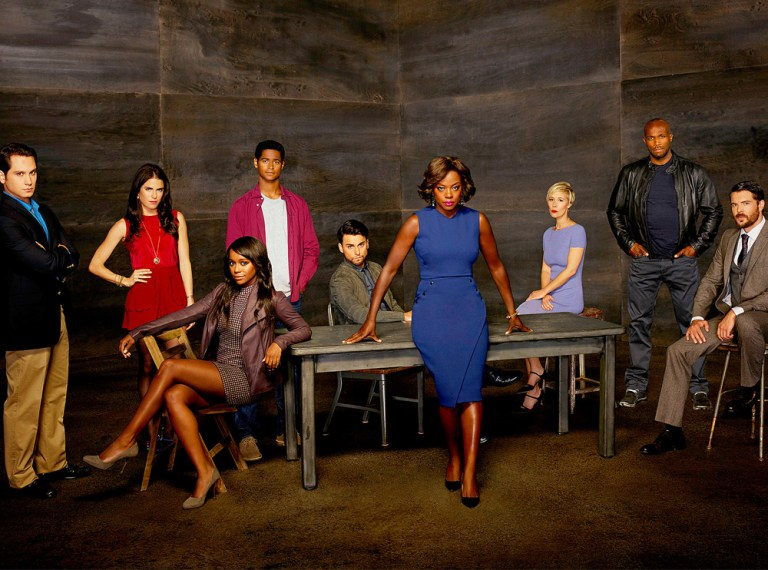

# Introduction
<i><b> How to Get Away with Murder </i></b> is an American legal thriller television series that premiered on ABC on September 25, 2014, and concluded on May 14, 2020. The series was created by Peter Nowalk, and produced by Shonda Rhimes and ABC Studios. The series aired on ABC as part of a night of programming, all under Rhimes's Shondaland production company.

<b>Season 1 Summary </b><br>
Annalise Keating is a prominent criminal defense attorney and law professor at Middleton University in Philadelphia. She selects five of her first year students to intern at her firm: Wes Gibbins, Connor Walsh, Michaela Pratt, Asher Millstone, and Laurel Castillo (The Keating 5). They work with Annalise's employees, Frank Delfino and Bonnie Winterbottom, an associate lawyer. As the first season introduces occasional clients for Keating, it explores two related murders through both flashback and flashforward sequences: Lila Stangard, mistress of Annalise's husband and a student at Middleton, and then Sam Keating, Annalise's husband, who was killed by Annalise's interns.

The first nine episodes alternate between the present-day timeline in medias res, depicting Wes, Connor, Michaela, and Laurel covering up Sam's murder by disposing of his body, and flashbacks detailing the course of events leading up to Sam's death, including Annalise's becoming involved in the Lila Stangard investigation, at Wes's urging, leading her to discover Sam's affair and creating suspicion that he killed Lila. The final six episodes explore Annalise's attempt to help her interns cover up Sam's murder and legally implicate Sam in Lila's death, and flashbacks to Lila's final moments before her murder.

```{r, fig.align = 'left', echo=FALSE, out.width='80%' }

```


# Viewership
## Summary
The series pilot on September 25 <b> set a record for DVR playback viewers with 6 million </b>, surpassing the January 27, 2014, record of 5.6 million set by the pilot of The Blacklist The series premiere had more than 14 million viewers on live broadcast, and over 20 million with DVR.

```{r, echo = FALSE}
dfViewership = read.csv('Viewership.csv')
dfViewershipNext = dfViewership
dfViewershipNext$seasonNext = lapply(dfViewershipNext$season,function(x){x+1})
dfViewershipDelta = merge(dfViewership[,c('season','overall_viewership')], dfViewershipNext[,c('seasonNext','overall_viewership')], by.x = 'season', by.y = 'seasonNext')
dfViewershipDelta$change_LastSeason = sapply(dfViewershipDelta$overall_viewership.x - dfViewershipDelta$overall_viewership.y, function(x){round(x,digit = 2)})
dfViewershipDelta = dfViewershipDelta[,c('season','change_LastSeason')]

```

```{r, echo = FALSE}
knitr::kable(dfViewership)  # NA is displayed by default
```

## Graphs
```{r, echo = FALSE}
library (ggplot2)
plot1 <- ggplot(data = dfViewership, aes(x = season, y = overall_viewership )) + 
  geom_bar(stat = 'identity', fill = 'darkgoldenrod2') +
  labs(x = '', y = '') +
  theme_bw() +
  theme(plot.title = element_text(hjust = 0.5), axis.text.x = element_text(angle = 0,colour = 'black',size = 12),
        axis.text.y = element_blank(), title = element_text(size = 14),legend.title = element_blank(), axis.ticks.y = element_blank(),
        panel.grid.major = element_blank(), panel.grid.minor = element_blank(),
        axis.title.x = element_text(size = 12), axis.title.y = element_text(size = 12)
        ) +
  geom_text(aes(label = overall_viewership), size = 5, ) +
  scale_x_continuous(breaks=seq(1,6,1)) + 
  labs(y="Overall Viewership (millions)", x = "Season") +
  ggtitle("Viewership over time")

library (ggplot2)
plot2 <- ggplot(data = dfViewershipDelta, aes(x = season, y = change_LastSeason )) + 
  geom_bar(stat = 'identity', fill = 'darkcyan') +
  labs(x = '', y = '') +
  theme_bw() +
  theme(plot.title = element_text(hjust = 0.5), axis.text.x = element_text(angle = 0,colour = 'black',size = 12),
        axis.text.y = element_blank(), title = element_text(size = 14),legend.title = element_blank(), axis.ticks.y = element_blank(),
        panel.grid.major = element_blank(), panel.grid.minor = element_blank(),
        axis.title.x = element_text(size = 12), axis.title.y = element_text(size = 12)
        ) +
  geom_text(aes(label = change_LastSeason), size = 5, ) +
  scale_x_continuous(breaks=seq(1,6,1)) + 
  labs(y="Changes (millions)", x = "Season") +
  ggtitle("Change in Overall Viewership \nseason-to-season")


plot1

plot2
```

## Comments
The viewership dropped the largest by `r dfViewership[dfViewership$season == 2, 'overall_viewership'] - dfViewership[dfViewership$season == 3, 'overall_viewership']` millions between seasons 2 and season 3. Compared to the first season, the last season have less `r dfViewership[dfViewership$season == 1, 'overall_viewership'] - dfViewership[dfViewership$season == 6, 'overall_viewership']` million viewers on average.

