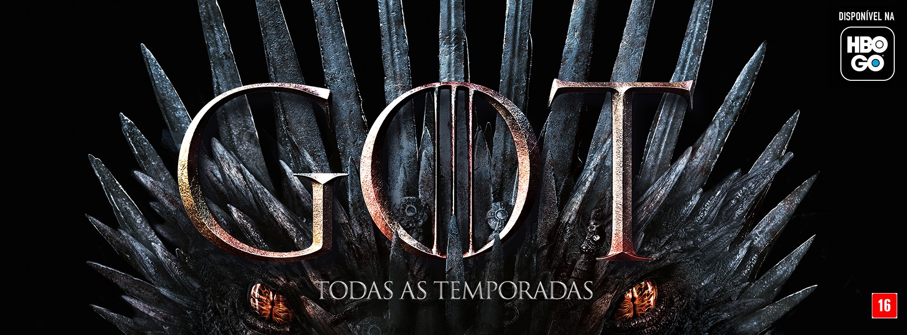

```{r setup, include=FALSE}
knitr::opts_chunk$set(echo = FALSE)
load(sprintf("../april_05_09/Data/season_%s.RData",params$season))
library('stringi')
require("xtable")
require("wordcloud2")
require("wordcloud")
require("RColorBrewer")
require("tm")
require('dplyr')
```
# Overview
## Story
Game of Thrones is a fantasy drama series, adapted from of A Song of Ice and Fire novels by George R. R. Martin

> - <b> Seven Kingdoms </b> of Westeros with political conflicts to claim the Iron throne or fighting for independence
> - The last descendant of the realm's deposed ruling dynasty, plots a <b> return  to the throne </b> 
> - The Night's Watch, a military order defending the realm against <b> threats from the North </b>
.

## The Opening 
<iframe width="420" height="315"
src="https://www.youtube.com/embed/s7L2PVdrb_8">
</iframe>

## Quotes {.smaller .build data-background=img/GOT3.jpg}

<div class="box" id = "quotes1"><em> 
"Winter is coming." - Ned Stark <br> <br>
"Any man who must say ‘I am the king’ is no true king." - Tywin Lannister <br> <br>
"All men must die, but we are not men." - Daenerys Targaryen
</em></div>

# My favorite season |Season `r params$season` 

## Season `r params$season` summary {.smaller}
<div>Season `r params$season` of Game of Thrones consisted of `r nrow(season_data)` episodes that aired between `r stri_sub(season_data[1,'premiere_date'],-11,-2)` and `r stri_sub(season_data[nrow(season_data),'premiere_date'],-11,-2)` on HBO. <br>The show gathered an average of `r season_data[1,'viewers']` million first-day TV viewers in the US, with the number growing from  `r season_data[1,'viewers']` to  `r season_data[nrow(season_data),'viewers']` million by the end of the season.
<br><br>
The most popular episode of the season `r params$season` was `r season_data[which.max(season_data$viewers),'title']`, in which:
</div>
<div class="brief" id = "briefId"><em>`r season_data[which.max(season_data$viewers),'description']`</em></div>

## Season's viewership
```{r viewers_plot}
plot(season_data$viewers, type="l", col="darkblue", lwd=5, xlab = "Episode number", ylab = "1st day TV viewers in the US (millions)")
```

## Keywords
Episodes with the word <span class = 'red'>`r params$keyword` </span> in the description were:
```{r, echo = FALSE}
knitr::kable(season_data[grepl(params$keyword, sapply(season_data$description, tolower)),c('no_season','title','viewers')],
             col.names = c('No. in season','Title','Number of viewers'), )  
```


